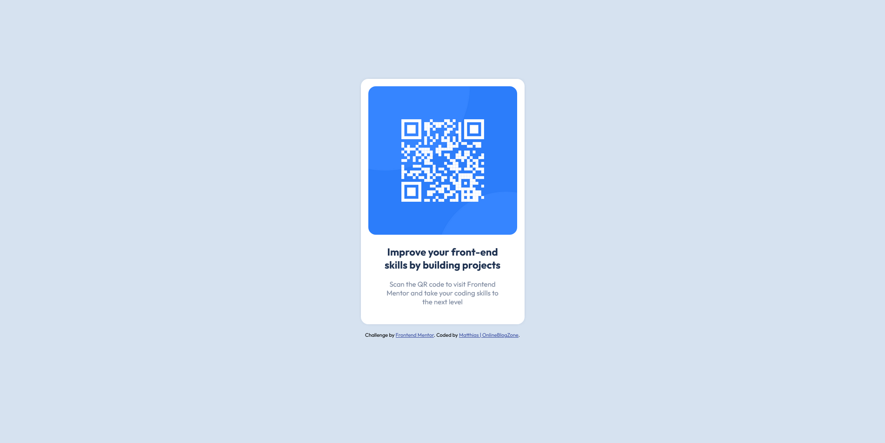

# Frontend Mentor - QR code component solution

This is a solution to the [QR code component challenge on Frontend Mentor](https://www.frontendmentor.io/challenges/qr-code-component-iux_sIO_H). Frontend Mentor challenges help you improve your coding skills by building realistic projects. 

## Table of contents

- [Overview](#overview)
  - [Screenshot](#screenshot)
  - [Links](#links)
- [My process](#my-process)
  - [Built with](#built-with)
  - [What I learned](#what-i-learned)
  - [Continued development](#continued-development)
  - [Useful resources](#useful-resources)
- [Author](#author)
- [Acknowledgments](#acknowledgments)

## Overview
This README will provide insight and information abou my solution for the QR code challenge hosted by [Frontend Mentor](https://www.frontendmentor.io/).

### Screenshot



### Links

- Solution URL: [Add solution URL here](https://your-solution-url.com)
- Live Site URL: [Add live site URL here](https://your-live-site-url.com)

## My process
I started this challenge by first putting my browser into responsive mobile mode with 375px of width.

Next, I started laying out the HTML structure by adding the QR code image, heading text and the paragraph. Just plain old HTML with no CSS flavour. When I had the bare HTML written down I started grouping elements by wrapping them with DIV-elements. This grouping of elements is literally envisioning what you need to build. At this point my HTML was looking like

```HTML
<body>
  
  <h2>
    Improve your front-end skills by building projects
  </h2>
  <p>
    Scan the QR code to visit Frontend Mentor and take your coding skills to the next level
  </p>
</body>

```

For this challenge, we're looking at a card. Inside this card we have the image and content. This means that I would wrap my HTML image, heading and paragraph with an element and give this the `card` class. I wanted to use flexbox for the layout so I wrapped the image and content with their own DIV-elements. This resulted in the following HTML

```HTML

<body>
  <div class="card">
    <div>
      
    </div>
    <div>
      <h2>
        Improve your front-end skills by building projects
      </h2>
      <p>
        Scan the QR code to visit Frontend Mentor and take your coding skills to the next level
      </p>
    </div>
  </div>
</body>
```

Since I wanted to use the BEM methodology for this challenge, this was the point where I started naming my elements accordingly. This resulted into the following HTML

```HTML
<body>
  <div class="card">
    <div class="card__header">
      
    </div>
    <div class="card__content">
      <h2 class="card__heading">
        Improve your front-end skills by building projects
      </h2>
      <p class="card__subtext">
        Scan the QR code to visit Frontend Mentor and take your coding skills to the next level
      </p>
    </div>
  </div>
</body>
```

For this point on, it was a matter of styling everything since my initial HTML structure included everything I needed.

For my CSS process I think the most noteworthy point is that I used variables for the colours and REM wherever possible. The benefit of using variables is that, in the case of a colour changing, you only need to change this on one spot. For this example, this might not be a lot of work but if your CSS file has thousands of lines it will get more annoying.

Using REM is a good principle since it's relative to the size of the root element. Most browsers use 16px as their default font size which means that `1rem = 16px`. If you now change the root font-size to, say 12px, all elements will scale accordingly because they're directly linked to the font-size.

### Built with

- Pure HTML
- Pure CSS
- BEM methodology
- Flexbox
- Mobile-first workflow

### What I learned
Since this challenge is a beginnner friendly challenge I tried to implement the BEM methodology. This is something I haven't really used a lot before so it was a good refresher to how the naming conventions and principles go.

This challenge was made without the Figma files so it is a good exercise to mix and match with sizes and get more of a feeling for that process. 

### Continued development

For continued development the biggest improvement could be to get it closer to the design files. There are still some size / spacing issues which can be improved. One being the paragraph indent compared to the heading.

### Useful resources

- [The BEM documentation](https://getbem.com/introduction/) - Since it was a refresher on how the BEM methodology works, the documentation is always a good thing to have open.
- [PX to REM converter](https://nekocalc.com/px-to-rem-converter) - I didn't quite need it for this challenge specific but I still want to give a mention to this for the people who, like me, struggle with basic maths.

## Author

- Website - [Matthias](https://onlineblogzone.com)
- Frontend Mentor - [@onlineblogzone](https://www.frontendmentor.io/profile/onlineblogzone)
- Twitter - [@Online.Blog.Zone](https://www.twitter.com/OnlineBlogZone)

## Acknowledgments

Shout-out to friend and co-author for OnlineBlogZone, [Richard](https://onlineblogzone.com/author/richard). Check out his solution [here](https://github.com/OnlineBlogZone/FrontendMentorQRCodeSolution2)